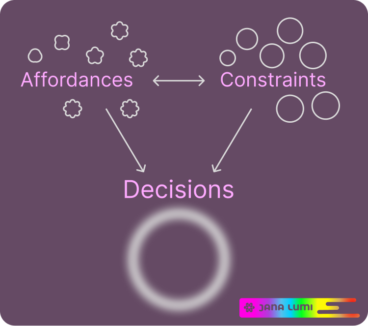

# Research Portfolio

> **Investigating how interactive tools can help people navigate complex systems for everyday decision making.**

My work explores how digital interfaces can make complex systems more understandable and more navigable without replacing human judgement. Rather than designing systems that persuade people towards a particular outcome, I investigate ways of making relevant information, relationships and context more visible, allowing people to decide according to their own priorities and values.

Many contemporary digital systems optimise for speed, engagement or sales. My research instead asks how interface design can help people navigate complexity at an appropriate pace, particularly when decisions involve uncertainty, multiple trade-offs or long-term consequences.

## Practice-Based Research

My research follows a practice-based approach in which interactive prototypes are developed as research instruments rather than simply demonstrations of finished ideas. Designing, building and testing interfaces allows research questions to be explored through practice. Each iteration generates new observations, raises new questions and informs the next stage of investigation.

Rather than separating theory from implementation, I use design, software development and critical reflection as complementary methods of inquiry. The resulting prototypes make ideas tangible, creating opportunities to investigate how people navigate complexity, interact with information and make decisions within changing contexts. Written research remains an important part of this process, but it is complemented by working systems that can be explored, questioned and evaluated in practice.

## Perspective

My research is informed by systems thinking, community information ecologies and practice-based design research.

Earlier work investigating neighbourhoods, participation and sharing economies highlighted how people, objects and information exist within evolving networks of relationships. These systems cannot always be understood through observation alone.

Building interactive systems becomes a way of investigating those relationships. Prototypes allow research questions to be explored through practice, while decision navigation provides one means of examining how people orient themselves within complex information ecologies.

## Previous Research

Prior to my current focus on decision navigation, I investigated community information ecologies and neighbourhood-scale participation. These projects continue to inform my understanding of systems thinking, context and the relationships between people, places and digital technologies.

Selected publication:
ResNei: Solution Design Document (2025) https://zenodo.org/records/16753709

---

# Research Themes

| Case Study                      | What people are navigating   |
| ------------------------------- | ---------------------------- |
| **Typoscale**                   | Design decisions             |
| **ArtWork**                     | Art and aesthetic decisions  |
| **MatchBot**                    | Organisational relationships |
| **Product Navigator** (planned) | Consumer products            |

## 1. Context-Aware Decision Making

**Research Question**

> How can interactive systems help people make informed, context-aware decisions without overwhelming them or making the decision for them?

### Case Study — [Typoscale](https://typoscale.netlify.app/)

Typoscale explores how interactive design tools can support people navigating complex interface design decisions through real-time experimentation rather than fixed templates or trial-and-error.

Research themes include:

- design decision support
- design systems
- responsive typography and scaling
- multi-theme exploration and comparison
- colour relationships and accessibility
- reducing cognitive load during interface design
- human judgement supported rather than replaced

The project investigates how interactive tooling can make interface design more approachable by inviting people to explore typography, colour and layout together within a single environment. Rather than prescribing design choices, Typoscale enables users to compare alternatives, understand relationships between design elements, and develop accessible interfaces through exploration.

The project also explores how design tools can broaden access to good interface design practices beyond specialist training. By making accessibility, typography and colour relationships easier to understand and experiment with, the interface aims to support a wider community of people creating digital experiences, from personal websites to community projects and small businesses.

---

### Case Study — [ArtWork](https://janalumi.github.io/ArtWork/)

ArtWork explores how people discover and choose artworks through interactive exploration rather than recommendation algorithms.

Research themes include:

- lighting as contextual information
- situated viewing of artworks
- colour relationships
- decision pacing
- meaningful pauses during exploration
- environmental and material awareness
- future AI-assisted metadata generation

The project investigates how interfaces can reveal relationships that are often hidden during online purchasing while allowing users to remain in control of their own decisions.

---

### Case Study — [MatchBot](https://matchbot.netlify.app/)

MatchBot explores how people navigate complex organisational information through interactive exploration and collaborative conversation rather than automated matching or recommendation systems.

Research themes include:

- collaborative decision navigation
- interactive information filtering
- conversational facilitation
- progressive elimination ("Guess Who?") as a navigation technique
- visible relationships between organisations
- privacy-conscious UX research
- human judgement supported rather than replaced

The project investigates how interfaces can externalise complex information, helping people orient themselves, explore possibilities together, and navigate uncertainty while keeping human conversation and decision-making at the centre of the process.

---

### Case Study — [Product Navigator](https://robotvacnavigator.netlify.app/)

This project extends the same research principles beyond artworks.

Rather than browsing large spreadsheets or commercial catalogues, users navigate products through interactive visualisations and contextual filters.

Research themes:

- decision making
- product lifecycle (LCA)
- ecological and social impact
- suitability and compatibility
- repairability and maintenance
- long-term ownership

The direction is not to recommend products but to make complex product information more navigable.

---

# Design Orientation

*About the image: Decision navigation emerges through the balance of affordances and constraints. Rather than treating these as fixed properties, this research investigates how their interaction shapes opportunities for exploration, participation and informed judgement.*

Design decisions are never neutral, nor objective. Every affordance and every constraint redistributes opportunities, responsibilities and effort. Measures intended to reduce misuse may also introduce new barriers, and those barriers are not experienced equally.

This research investigates how interactive systems can balance these trade-offs while expanding people's ability to navigate information, understand consequences and exercise informed judgement. The question is not only what an interface allows or prevents, but who benefits, who carries the additional effort, and whose ways of interacting become possible or impossible.

## Progressive Disclosure of Context

Information does not need to appear all at once, nor should it remain hidden behind opaque systems.

As people explore and compare alternatives, interfaces can progressively reveal additional layers of context that become relevant to the decisions they are making.

Rather than accelerating users towards predetermined outcomes, this approach supports progressive understanding. Information is revealed when it helps people orient themselves, compare possibilities and recognise relationships that might otherwise remain hidden.

The objective is not to maximise engagement or conversion, but to help people develop an increasingly informed understanding of the systems they are navigating.

## Systems Thinking

Objects do not exist in isolation. They exist within networks of relationships that change over time.

An artwork exists within a room, where light, colour, architecture and neighbouring objects all influence how it is experienced.

A product exists within a lifecycle, from material extraction and manufacture to maintenance, repair, reuse and eventual recycling or disposal.

Objects may also exist within communities, passing between people through sharing, lending, repair and collective stewardship rather than individual ownership alone.

Interfaces can help make these relationships visible, enabling people to navigate not only individual objects but also the broader systems in which they participate.

## Designing for navigation

Many commercial interfaces optimise for engagement, conversion or retention. This research instead investigates interfaces that optimise for contextual awareness and information navigation. Rather than prematurely narrowing possibilities, my work explores how interfaces can provide people with tooling to navigate complex systems through exploration, comparison and context.

---

# Long-Term Research Direction

My long-term research investigates how interactive systems can help people navigate complex and evolving relationships between people, objects, materials, environments and communities.

The individual projects shown here are not isolated applications. They are case studies within an ongoing practice-based research programme exploring interface design for navigating complexity in everyday life.
